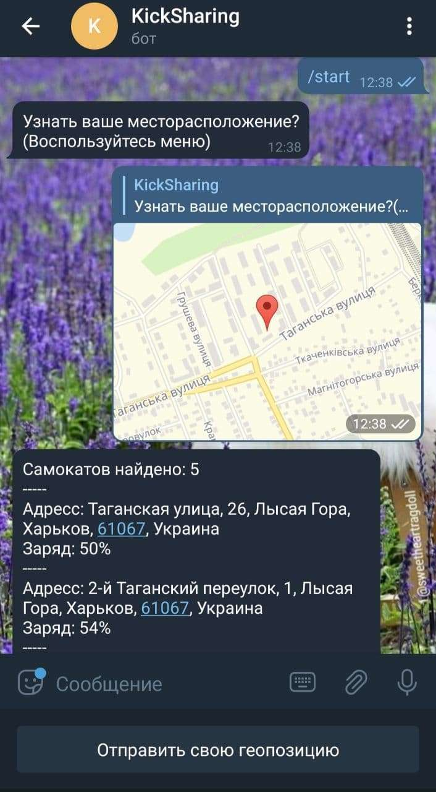
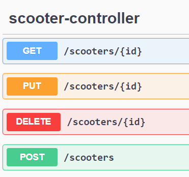

Финальный проект курсов A-level
---
Kick-sharing bot (Scooter-sharing)
---
__Кик-шеринг__ - аренда электросамокатов, по аноголии с каршерингом

Бот по локации, предоставляемой пользователем, показывает информацию о ближайших самокатов (их адрес и остаток заряда)

Демонстрация его работы

---

Также создан API для возможных самокатов, которые будут предавать данные в базу данных.

---
#Использовалось
1. База данных: MySQL;
2. Spring Boot;
3. Библиотека "telegrambots" - для написания бота;
4. Библиотека "jopencage" - для расшифровки координат геопозиции;
5. ORM Hibernate;
---
Для работы приложения нужно получить token и webhookpath для работы бота.

Также для работы библиотеки jopencage требуется иметь api.key разработчика, который можно получить на официальном сайте библиотеки